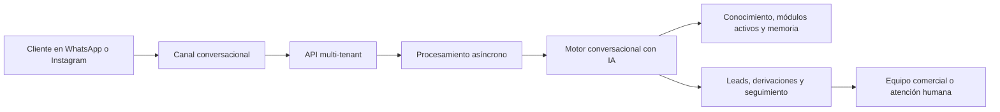

# LeadBOT

LeadBOT es una plataforma SaaS multi-tenant para automatizar atención comercial, captación y calificación de leads desde canales conversacionales como WhatsApp e Instagram.

Este repositorio es una presentación pública de portfolio. No contiene el código fuente productivo, prompts internos, credenciales, infraestructura operativa ni reglas comerciales sensibles.

## Qué problema resuelve

Muchos negocios reciben consultas por WhatsApp, redes o formularios, pero pierden oportunidades porque la respuesta depende de atención manual, memoria informal y seguimiento desordenado. LeadBOT centraliza esas conversaciones, responde con IA según el contexto del negocio, califica el interés comercial y deriva los casos listos para intervención humana.

## Funcionalidades principales

- Inbox multi-canal para conversaciones entrantes.
- Bot con IA configurable por tenant.
- Base de conocimiento del negocio para respuestas contextualizadas.
- Calificación automática de leads.
- Derivación a humanos cuando el caso está listo.
- Seguimiento comercial tipo CRM.
- Módulos opcionales para servicios, turnos, catálogo, stock y pedidos.
- Panel de configuración por cliente.
- Arquitectura preparada para múltiples proveedores de IA.

## Módulos del producto

| Módulo | Propósito |
| --- | --- |
| Inbox | Centraliza conversaciones y mensajes de clientes. |
| Bot IA | Atiende consultas, razona contexto y mantiene continuidad conversacional. |
| Conocimiento | Permite cargar información del negocio para orientar respuestas. |
| Leads | Detecta intención, necesidad, temperatura comercial y próximos pasos. |
| Derivaciones | Pasa conversaciones calificadas a una persona del equipo. |
| Seguimiento comercial | Ordena oportunidades y estados de avance. |
| Servicios y turnos | Gestiona prestaciones, disponibilidad y solicitudes de agenda. |
| Comercio | Soporta catálogo, stock, pedidos y consultas comerciales cuando el módulo está activo. |

## Arquitectura general

La arquitectura está diseñada para separar el producto en capas: recepción de mensajes, procesamiento asíncrono, razonamiento con IA, persistencia multi-tenant y operación comercial.

## Stack utilizado

- Backend: Node.js, NestJS, TypeScript y Prisma.
- Frontend: React, Vite y Tailwind CSS.
- Base de datos: PostgreSQL con capacidades de búsqueda semántica/vectorial.
- Colas y cache: Redis y procesamiento asíncrono.
- IA: integración multi-proveedor mediante clientes configurables por tenant.
- Infraestructura: despliegue contenerizado con Docker y proxy reverso.

## Decisiones de diseño destacadas

- Multi-tenancy desde la base del modelo: cada cliente mantiene configuración, datos y módulos propios.
- Procesamiento asíncrono para no bloquear la recepción de eventos externos.
- Separación entre IA generativa y reglas determinísticas para operaciones sensibles.
- Gobierno de respuestas para evitar repetición, pérdida de contexto o filtrado de razonamiento interno.
- Handoff humano cuando la conversación alcanza un punto comercialmente accionable.
- Activación modular para adaptar el producto a negocios de servicios, comercio o atención profesional.

## Qué se muestra en este repositorio

- Descripción del producto.
- Arquitectura de alto nivel.
- Casos de uso.
- Tecnologías utilizadas.
- Decisiones técnicas y desafíos resueltos.
- Guía de demo para entrevistas o portfolio.

## Qué no se publica

- Código completo del backend o frontend.
- Prompts productivos.
- Lógica detallada de scoring o clasificación.
- Credenciales, tokens, variables de entorno o dominios internos.
- Esquema completo de base de datos.
- Configuración de infraestructura o webhooks.
- Integraciones internas que permitan replicar el producto.

## Estado

Proyecto propietario desarrollado por Connectia-LABS. Este repositorio funciona como showcase profesional y documentación pública controlada.

## Documentación

- [Arquitectura de alto nivel](docs/architecture.md)
- [Funcionalidades y casos de uso](docs/features-and-use-cases.md)
- [Decisiones técnicas](docs/technical-decisions.md)
- [Guía de demo para portfolio](docs/demo-guide.md)
- [Capturas y material visual](docs/screenshots.md)
- [Alcance público y límites de divulgación](docs/public-disclosure.md)

## Derechos

Copyright © 2026 Connectia-LABS. All rights reserved.
