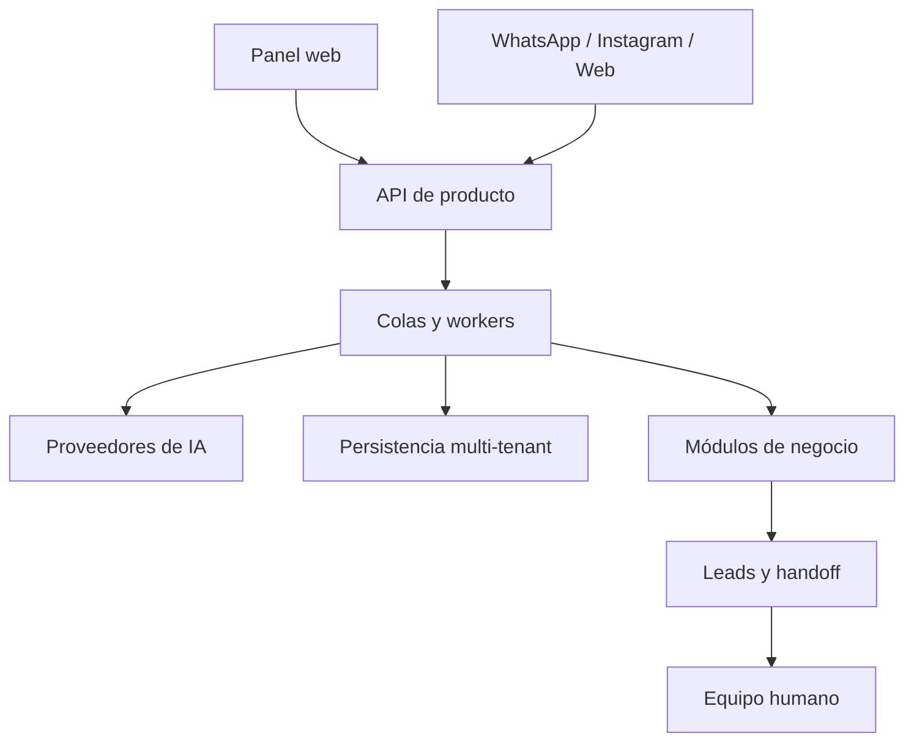

# Arquitectura de alto nivel

LeadBOT está diseñado como un SaaS multi-tenant: cada cliente opera con su propia configuración, módulos activos, canales conectados, base de conocimiento y flujo comercial.

Este documento describe la arquitectura sin publicar implementación interna ni detalles sensibles.

## Capas principales

## Flujo conversacional

1. El cliente escribe por un canal conversacional.
2. La plataforma identifica el tenant y registra el mensaje.
3. El procesamiento asíncrono analiza historial, contexto y módulos activos.
4. El motor de IA genera una respuesta compatible con el objetivo del negocio.
5. El sistema actualiza lead, estado comercial y posible derivación humana.
6. Cuando el caso está calificado, se detiene la automatización y continúa una persona.

## Multi-tenancy

La separación por tenant es una decisión central del producto. Cada cliente puede tener:

- módulos activos diferentes;
- conocimiento propio;
- configuración de bot y tono;
- canales conectados;
- usuarios y permisos;
- leads, conversaciones y seguimientos separados.

## Procesamiento asíncrono

El uso de workers permite responder a eventos externos sin bloquear la recepción del mensaje. Esto mejora resiliencia, escalabilidad y trazabilidad operativa.

## IA y reglas determinísticas

LeadBOT combina IA generativa con reglas determinísticas. La IA se utiliza para comprensión, redacción y adaptación contextual; las operaciones sensibles se resuelven por servicios controlados del sistema.

Ejemplos de operaciones sensibles que no quedan libradas al modelo:

- cálculos de precio o totales;
- validaciones de stock;
- cambios de estado de pedidos;
- confirmación de turnos;
- cierre real de una derivación comercial.

## Seguridad de divulgación

Esta arquitectura está resumida para portfolio. No se publican endpoints internos, prompts, claves, modelos de datos completos, reglas de scoring ni infraestructura productiva.
